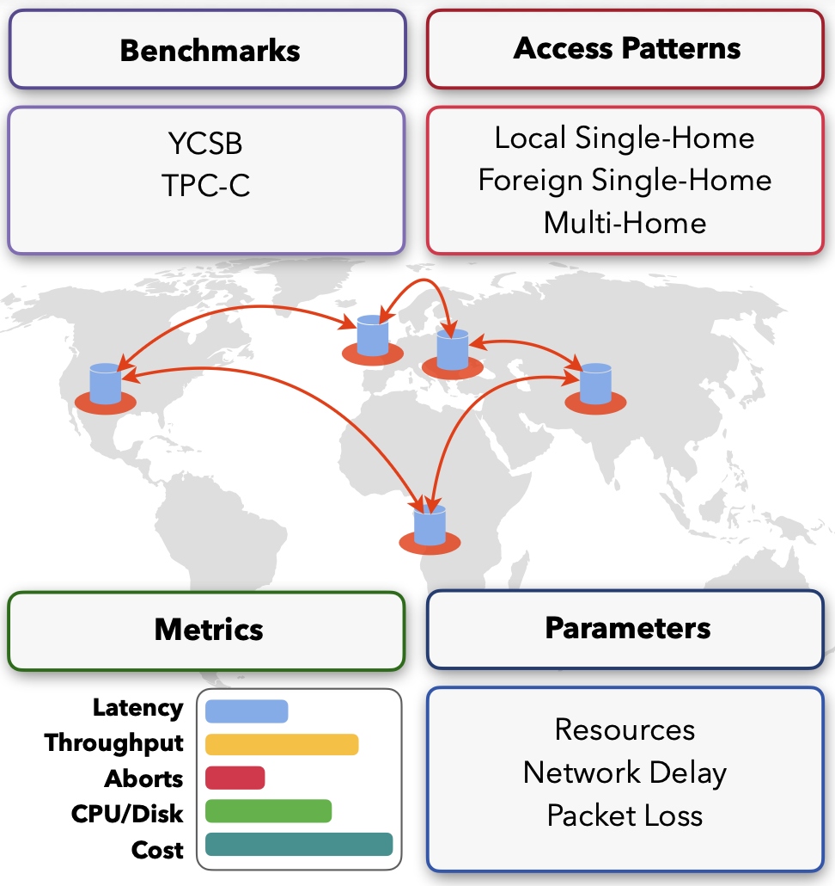

# Gaia

Gaia is a novel benchmarking framework for geo-distributed OLTP databases. It provides a set of scenarios (Varying Input Throughput, Resource Allocation, Access Patterns, Skew, Network Latency & Jitter, Packet Loss) and metrics (Throughput, Latency, Latency Breakdown, Aborts, Data Transfers, Cost per Transaction, Resource Utilization), to obtain a comprehensive understanding of the capabilities of the systems under test.

Gaia is built on top of the Detock codebase as that already provides abstractions for four SOTA systems under the same codebase implementation.

<p align="center">

</p>

## Running Gaia

To run Gaia, first compile using the instructions in [Build.md](Build.md). After compilation, you can spin up a database service. Instructions to spin up the database service are provided in [tools/README.md](tools/README.md). Finally you can run experiments, and extract results, and plot the results using those instructions.

For further experiments with CockroachDB, see instructions in [crdb/README.md](crdb/README.md)

For running experiments on AWS, refer to [aws/README.md](aws/README.md) which contains scripts how to spawn up and set up the necessary AWS VMs.

## Directory Structure

```
|- aws/
|--- Scripts and config files for spawning an AWS cluster to run the final experiments.
|- build/
|--- Makefiles, dependencies, compilier settings.
|- common/
|--- Various I/O functionality, sharding, batching, logging, thread utils.
|- connection/
|--- Broker, logging, polling, sending functionality.
|- examples/
|--- Example lists of transactions (having their read/write sets, operations, and cluster configs, e.g., ).
|--- Example DB conf files for different benchmarks (YCSB, TPC-C, PPS, SmallBank, MovR, DeathStar Hotels, DeathStar Movie).
|- execution/
|--- Detailed code for how the individual txn types execute. (Also includes OrderStatus, Delivery, StockLevel)
|- experiments/
|--- Configs for the individual experiments. For us tpcc is most important.
| |- cockroach
| |--- Configs for Cockrach DB comaprison experiments
| |- tpcc
| |--- Configs for TPC-C experiments
| |- ycsb
| |--- Configs for YCSB experiments
|- latex_generators/
|--- Python scripts that create some of the latex code for certain tables in the paper Overleaf.
|- module/
|--- Actuall logic of the system (i.e. the sequencer, scheduler, orderer, forwarder, etc.)
|- paxos/
|--- Paxos logic implementation. Used for (asyncronous) replication.
|- plots/
|--- Scripts for extracting results from experiments scripts and for generating the plots.
|--- Output graphs and figures for experiments presented in the paper.
|- proto/
|--- Protobuf message specifications for txn, config, internal, etc. objects.
|- service/
|--- Service on the client side for the compared systems.
|- storage/
|--- Implements the storage layer, initializes metadata, loads tables (tpcc_partitioning for TPC-C, simple_partitioning for YCSB-T microbenchmark, simple_partitioning2 for Cockroach experiments again using YCSB-T).
|- test/
|--- Test for various parts of the system. Also isolates sequencer/scheduler pretty well.
|- tools/
|--- Helper scripts to run expeiments. 'tools/run_confug_on_remote.py' is the entry point to running all experiments.
|- workload/
|--- Other setup for TPC-C, cockroachDB, remastering experiments, and for novel workloads.
|- build_detock.sh
|--- Script for building the database from source and creating a Docker image.
|- build_detock.sh
|--- Script for building the database from source and creating a Docker image.
```
