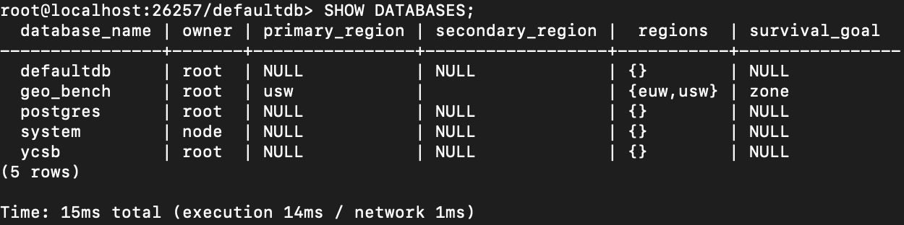
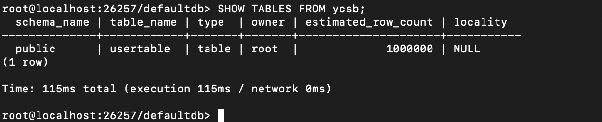

# Running the Open Source version of CRDB

## Setup

Run `bash crdb/setup.sh` to download CRDB and installs dependencies.

Run `bash crdb/build.sh` to build CRDB and create a Docker image.

Note: You may be asked to run `./dev doctor` when building.

For `./dev doctor` answer

1. Enter
2. Enter
3. Enter
4. Enter

Then you can rebuild:

`BAZEL=/usr/local/bin/bazel ./dev build short -- --define=oss=true`

## Launching a CRDB cluster

The `crdb/manage_crdb.py` script can launch and tear down a CRDB cluster

`python3 crdb/manage_crdb.py --action start --config crdb/tu_cluster_crdb.json --license crdb/crdb_license.json -w ycsb -p <YOUR_PASSWORD>`

`python3 crdb/manage_crdb.py --action stop --config crdb/tu_cluster_crdb.json --license crdb/crdb_license.json -w ycsb -p <YOUR_PASSWORD>`

OR on AWS:

`python3 crdb/manage_crdb.py --action start --config aws/aws_crdb.json --license crdb/crdb_license.json -w ycsb -u ubuntu -e aws -cp 16 -me 128`

`python3 crdb/manage_crdb.py --action stop --config aws/aws_crdb.json --license crdb/crdb_license.json -w ycsb -u ubuntu -e aws`

(Note: you may need to Start, Stop, and Start again. Seems CRDB can't get past the fact that we try to add a secondary region as backup, before it's actually been created)

## To prepopulate your CRDB database with YCSB data

`docker exec -it crdb-node ./cockroach workload init ycsb --insert-count=1000000   "postgresql://root@131.180.125.40:26257?sslmode=disable"`

## If you want to manually enter one of your CRDB database nodes

`docker exec -it crdb-node  ./cockroach sql --insecure`

## Some useful (manual) SQL commands to check what's happening inside

Show all databses and their contents `SHOW DATABASES;` It will give you something like this:

Get all contents of YCSB database tables: `SHOW TABLES FROM geo_bench;`

Note to interact more closely with the contents of a specific table, you (probably) have to 'USE' that database, to actually enter it:

`USE geo_bench;`

After that you can easily access the actual data:

`SELECT * FROM usertable LIMIT 10;`

Check the no. of rows in the table:

`SELECT COUNT(*) FROM usertable;`

Run a transaction with a single key:

Run a transaction with 10 keys (like in YCSB):

<code>
BEGIN; 
UPSERT INTO usertable (ycsb_key, field0) VALUES (1, '\x01beef01'); 
UPSERT INTO usertable (ycsb_key, field0) VALUES (2, '\x01beef02'); 
UPSERT INTO usertable (ycsb_key, field0) VALUES (3, '\x01beef03'); 
UPSERT INTO usertable (ycsb_key, field0) VALUES (4, '\x01beef04'); 
UPSERT INTO usertable (ycsb_key, field0) VALUES (5, '\x01beef05'); 
UPSERT INTO usertable (ycsb_key, field0) VALUES (6, '\x01beef06'); 
UPSERT INTO usertable (ycsb_key, field0) VALUES (7, '\x01beef07'); 
UPSERT INTO usertable (ycsb_key, field0) VALUES (8, '\x01beef08'); 
UPSERT INTO usertable (ycsb_key, field0) VALUES (9, '\x01beef09'); 
UPSERT INTO usertable (ycsb_key, field0) VALUES (10, '\x01beef10'); 
COMMIT; 
</code>

To run a real benchmark, you can use the custom benchmark tool `crdb/benchmark_crdb.cpp`. Compile it with:

`g++ -std=c++17 crdb/benchmark_crdb.cpp -o benchmark_crdb -lpqxx -lpq -lglog`

Then run the binary using:

`./benchmark_crdb`

To create a Docker image of the CRDB benchmark script:

`cd crdb`

Build the Docker image

`docker build -t omraz/seq_eval:crdb_benchmark .`

Push the image to the repo:

`docker push omraz/seq_eval:crdb_benchmark`

## Various useful SQL snippets:

To create a fault-tolerant multi-region setup on AWS with control over how data is partitioned:

`ALTER TABLE usertable ADD COLUMN home_region crdb_internal_region AS (
  CASE 
    WHEN ycsb_key < 1250000 THEN 'usw1'
    WHEN ycsb_key < 2500000 THEN 'usw2'
    WHEN ycsb_key < 3750000 THEN 'use1'
    WHEN ycsb_key < 5000000 THEN 'use2'
    WHEN ycsb_key < 6250000 THEN 'euw1'
    WHEN ycsb_key < 7500000 THEN 'euw2'
    WHEN ycsb_key < 8750000 THEN 'apne1'
    ELSE 'apne2'
  END
) STORED;`

`ALTER TABLE usertable ALTER COLUMN home_region SET NOT NULL;`

`ALTER TABLE usertable SET LOCALITY REGIONAL BY ROW AS home_region;`

Check by running:

`SHOW PARTITIONS FROM TABLE usertable;`

You should see the repective region names under the 'partition_name' column.

Force CRDB to split up the data:

`ALTER TABLE usertable SPLIT AT VALUES (1250000), (2500000), (3750000), (5000000), (6250000), (7500000), (8750000);`

`ALTER TABLE usertable SCATTER;`

To just get data placement control:

-- 1. Create a fresh database to ensure a clean slate
CREATE DATABASE bench_manual;
USE bench_manual;

-- 2. Create the table (do NOT add any special regions to the DB yet)
CREATE TABLE usertable (
    ycsb_key BIGINT PRIMARY KEY,
    field0 BYTES
);

-- 3. Pin Partitions to Regions (Manual Data Placement)
ALTER TABLE usertable PARTITION BY RANGE (ycsb_key) (
    PARTITION p1 VALUES FROM (MINVALUE) TO (1250000),
    PARTITION p2 VALUES FROM (1250000) TO (2500000),
    PARTITION p3 VALUES FROM (2500000) TO (3750000),
    PARTITION p4 VALUES FROM (3750000) TO (5000000),
    PARTITION p5 VALUES FROM (5000000) TO (6250000),
    PARTITION p6 VALUES FROM (6250000) TO (7500000),
    PARTITION p7 VALUES FROM (7500000) TO (8750000),
    PARTITION p8 VALUES FROM (8750000) TO (MAXVALUE)
);

-- Repeat this for all 8, matching p1 -> your 1st region, etc.
ALTER PARTITION p1 OF TABLE usertable CONFIGURE ZONE USING 
    num_replicas = 3,
    constraints = '{+region=usw1: 3}',
    lease_preferences = '[[+region=usw1]]';

ALTER PARTITION p2 OF TABLE usertable CONFIGURE ZONE USING 
    num_replicas = 3,
    constraints = '{+region=usw2: 3}',
    lease_preferences = '[[+region=usw2]]';

ALTER PARTITION p3 OF TABLE usertable CONFIGURE ZONE USING 
    num_replicas = 3,
    constraints = '{+region=use1: 3}',
    lease_preferences = '[[+region=use1]]';

ALTER PARTITION p4 OF TABLE usertable CONFIGURE ZONE USING 
    num_replicas = 3,
    constraints = '{+region=use2: 3}',
    lease_preferences = '[[+region=use2]]';

ALTER PARTITION p5 OF TABLE usertable CONFIGURE ZONE USING 
    num_replicas = 3,
    constraints = '{+region=euw1: 3}',
    lease_preferences = '[[+region=euw1]]';

ALTER PARTITION p6 OF TABLE usertable CONFIGURE ZONE USING 
    num_replicas = 3,
    constraints = '{+region=euw2: 3}',
    lease_preferences = '[[+region=euw2]]';

ALTER PARTITION p7 OF TABLE usertable CONFIGURE ZONE USING 
    num_replicas = 3,
    constraints = '{+region=apne1: 3}',
    lease_preferences = '[[+region=apne1]]';

ALTER PARTITION p8 OF TABLE usertable CONFIGURE ZONE USING 
    num_replicas = 3,
    constraints = '{+region=apne2: 3}',
    lease_preferences = '[[+region=apne2]]';

-- 4. The "Instant Movement" Trick

-- Scatter moves the physical ranges to match the constraints immediately
ALTER TABLE usertable SCATTER;

## Running TPC-C

The `crdb/manage_crdb.py` script can launch and tear down a CRDB cluster

`python3 crdb/manage_crdb.py --action start --config crdb/tu_cluster_crdb.json --license crdb/crdb_license.json -w tpcc -p <YOUR_PASSWORD>`

`python3 crdb/manage_crdb.py --action stop --config crdb/tu_cluster_crdb.json --license crdb/crdb_license.json -w tpcc -p <YOUR_PASSWORD>`

OR on AWS:

`python3 crdb/manage_crdb.py --action start --config aws/aws_crdb.json --license crdb/crdb_license.json -w tpcc -u ubuntu -e aws -cp 16 -me 128`

For Varying Hardware scenario
`python3 crdb/manage_crdb.py --action start --config aws/aws_crdb.json --license crdb/crdb_license.json -w tpcc -u ubuntu -e aws -cp 8 -me 32`   m5.2xlarge
`python3 crdb/manage_crdb.py --action start --config aws/aws_crdb.json --license crdb/crdb_license.json -w tpcc -u ubuntu -e aws -cp 8 -me 64`   r5.2xlarge
`python3 crdb/manage_crdb.py --action start --config aws/aws_crdb.json --license crdb/crdb_license.json -w tpcc -u ubuntu -e aws -cp 16 -me 64`  m5.4xlarge
`python3 crdb/manage_crdb.py --action start --config aws/aws_crdb.json --license crdb/crdb_license.json -w tpcc -u ubuntu -e aws -cp 16 -me 128` r5.4xlarge (default)
`python3 crdb/manage_crdb.py --action start --config aws/aws_crdb.json --license crdb/crdb_license.json -w tpcc -u ubuntu -e aws -cp 32 -me 128` m6i8xlarge

`python3 crdb/manage_crdb.py --action stop --config aws/aws_crdb.json --license crdb/crdb_license.json -w tpcc -u ubuntu -e aws`

The `populate_tpcc()` function will use CRDB's builtin workload preparation tool to prepopulate the TPC-C tables. The (not yet working) `apply_tpcc_geo_partitioning()` function should partition the data across the regions in the CRDB cluster.

### Manual TPC-C geo-partitioning

Enter the CRDB SQL console:

`docker exec -it crdb-node  ./cockroach sql --insecure`

Run the following commands to manually partition the TPC-C tables:

1. The Partitioning SQL
Connect to your SQL shell and run the following. Replace 50 with your actual midpoint if you have more/fewer than 100 warehouses.

USE geo_bench;

-- 1. WAREHOUSE
ALTER TABLE warehouse PARTITION BY RANGE (w_id) (
    PARTITION p1 VALUES FROM (MINVALUE) TO (50),
    PARTITION p2 VALUES FROM (50) TO (MAXVALUE)
);
-- 2. DISTRICT
ALTER TABLE district PARTITION BY RANGE (d_w_id) (
    PARTITION p1 VALUES FROM (MINVALUE) TO (50),
    PARTITION p2 VALUES FROM (50) TO (MAXVALUE)
);
-- 3. CUSTOMER
ALTER TABLE customer PARTITION BY RANGE (c_w_id) (
    PARTITION p1 VALUES FROM (MINVALUE) TO (50),
    PARTITION p2 VALUES FROM (50) TO (MAXVALUE)
);
-- 4. HISTORY
ALTER TABLE history PARTITION BY RANGE (h_w_id) (
    PARTITION p1 VALUES FROM (MINVALUE) TO (50),
    PARTITION p2 VALUES FROM (50) TO (MAXVALUE)
);
-- 5. ORDERS
ALTER TABLE "order" PARTITION BY RANGE (o_w_id) (
    PARTITION p1 VALUES FROM (MINVALUE) TO (50),
    PARTITION p2 VALUES FROM (50) TO (MAXVALUE)
);
-- 6. NEW_ORDER
ALTER TABLE new_order PARTITION BY RANGE (no_w_id) (
    PARTITION p1 VALUES FROM (MINVALUE) TO (50),
    PARTITION p2 VALUES FROM (50) TO (MAXVALUE)
);
-- 7. ORDER_LINE
ALTER TABLE order_line PARTITION BY RANGE (ol_w_id) (
    PARTITION p1 VALUES FROM (MINVALUE) TO (50),
    PARTITION p2 VALUES FROM (50) TO (MAXVALUE)
);
-- 8. STOCK
ALTER TABLE stock PARTITION BY RANGE (s_w_id) (
    PARTITION p1 VALUES FROM (MINVALUE) TO (50),
    PARTITION p2 VALUES FROM (50) TO (MAXVALUE)
);

2. The Placement SQL
Now that the partitions are defined, tell CockroachDB to physically pin them to your regions.

-- Apply this to EVERY table above.

ALTER PARTITION p1 OF TABLE warehouse CONFIGURE ZONE USING 
    num_replicas = 3,
    constraints = '{+region=euw: 2, +region=usw: 1}', 
    lease_preferences = '[[+region=euw]]';
ALTER PARTITION p2 OF TABLE warehouse CONFIGURE ZONE USING 
    num_replicas = 3,
    constraints = '{+region=usw: 2, +region=euw: 1}', 
    lease_preferences = '[[+region=usw]]';

ALTER PARTITION p1 OF TABLE district CONFIGURE ZONE USING 
    num_replicas = 3,
    constraints = '{+region=euw: 2, +region=usw: 1}', 
    lease_preferences = '[[+region=euw]]';
ALTER PARTITION p2 OF TABLE district CONFIGURE ZONE USING 
    num_replicas = 3,
    constraints = '{+region=usw: 2, +region=euw: 1}', 
    lease_preferences = '[[+region=usw]]';

ALTER PARTITION p1 OF TABLE customer CONFIGURE ZONE USING 
    num_replicas = 3,
    constraints = '{+region=euw: 2, +region=usw: 1}', 
    lease_preferences = '[[+region=euw]]';
ALTER PARTITION p2 OF TABLE customer CONFIGURE ZONE USING 
    num_replicas = 3,
    constraints = '{+region=usw: 2, +region=euw: 1}', 
    lease_preferences = '[[+region=usw]]';

ALTER PARTITION p1 OF TABLE history CONFIGURE ZONE USING 
    num_replicas = 3,
    constraints = '{+region=euw: 2, +region=usw: 1}', 
    lease_preferences = '[[+region=euw]]';
ALTER PARTITION p2 OF TABLE history CONFIGURE ZONE USING 
    num_replicas = 3,
    constraints = '{+region=usw: 2, +region=euw: 1}', 
    lease_preferences = '[[+region=usw]]';

ALTER PARTITION p1 OF TABLE "order" CONFIGURE ZONE USING 
    num_replicas = 3,
    constraints = '{+region=euw: 2, +region=usw: 1}', 
    lease_preferences = '[[+region=euw]]';
ALTER PARTITION p2 OF TABLE "order" CONFIGURE ZONE USING 
    num_replicas = 3,
    constraints = '{+region=usw: 2, +region=euw: 1}', 
    lease_preferences = '[[+region=usw]]';

ALTER PARTITION p1 OF TABLE new_order CONFIGURE ZONE USING 
    num_replicas = 3,
    constraints = '{+region=euw: 2, +region=usw: 1}', 
    lease_preferences = '[[+region=euw]]';
ALTER PARTITION p2 OF TABLE new_order CONFIGURE ZONE USING 
    num_replicas = 3,
    constraints = '{+region=usw: 2, +region=euw: 1}', 
    lease_preferences = '[[+region=usw]]';

ALTER PARTITION p1 OF TABLE order_line CONFIGURE ZONE USING 
    num_replicas = 3,
    constraints = '{+region=euw: 2, +region=usw: 1}', 
    lease_preferences = '[[+region=euw]]';
ALTER PARTITION p2 OF TABLE order_line CONFIGURE ZONE USING 
    num_replicas = 3,
    constraints = '{+region=usw: 2, +region=euw: 1}', 
    lease_preferences = '[[+region=usw]]';

ALTER PARTITION p1 OF TABLE stock CONFIGURE ZONE USING 
    num_replicas = 3,
    constraints = '{+region=euw: 2, +region=usw: 1}', 
    lease_preferences = '[[+region=euw]]';
ALTER PARTITION p2 OF TABLE stock CONFIGURE ZONE USING 
    num_replicas = 3,
    constraints = '{+region=usw: 2, +region=euw: 1}', 
    lease_preferences = '[[+region=usw]]';

-- Repeat the above two commands for: district, customer, history, "order", new_order, order_line, stock

3. The Scatter (Force Movement)
Finally, force the database to move the data right now instead of waiting for the background rebalancer.

ALTER TABLE warehouse SCATTER;
ALTER TABLE district SCATTER;
ALTER TABLE customer SCATTER;
ALTER TABLE history SCATTER;
ALTER TABLE orders SCATTER;
ALTER TABLE new_order SCATTER;
ALTER TABLE order_line SCATTER;
ALTER TABLE stock SCATTER;

### Geo-Partitioning Secondary Indexes

1. The Partitioning SQL (Secondary Indexes)
Run these to split the physical index structures:

USE geo_bench;
-- CUSTOMER: Used for looking up customers by last name
ALTER INDEX customer@customer_idx PARTITION BY RANGE (c_w_id) (
    PARTITION p1 VALUES FROM (MINVALUE) TO (50),
    PARTITION p2 VALUES FROM (50) TO (MAXVALUE)
);
-- ORDER: Used for looking up orders by customer
ALTER INDEX "order"@order_idx PARTITION BY RANGE (o_w_id) (
    PARTITION p1 VALUES FROM (MINVALUE) TO (50),
    PARTITION p2 VALUES FROM (50) TO (MAXVALUE)
);

2. The Placement SQL (Pinning Replicas)
Now, tell CockroachDB to keep those index entries in the same region as the data. Remember to include num_replicas = 3 to satisfy the zone config rules.

-- CUSTOMER INDEX PLACEMENT
ALTER PARTITION p1 OF INDEX customer@customer_idx CONFIGURE ZONE USING 
    num_replicas = 3, constraints = '{+region=euw: 3}', lease_preferences = '[[+region=euw]]';
ALTER PARTITION p2 OF INDEX customer@customer_idx CONFIGURE ZONE USING 
    num_replicas = 3, constraints = '{+region=usw: 3}', lease_preferences = '[[+region=usw]]';
-- ORDER INDEX PLACEMENT
ALTER PARTITION p1 OF INDEX "order"@order_idx CONFIGURE ZONE USING 
    num_replicas = 3, constraints = '{+region=euw: 3}', lease_preferences = '[[+region=euw]]';
ALTER PARTITION p2 OF INDEX "order"@order_idx CONFIGURE ZONE USING 
    num_replicas = 3, constraints = '{+region=usw: 3}', lease_preferences = '[[+region=usw]]';

-- This makes reads local for everyone
ALTER TABLE item CONFIGURE ZONE USING 
    num_replicas = 6,
    constraints = '{+region=euw: 3, +region=usw: 3}';

### Sanity Check

To check that the geopartitioning happened successfully use the command:

SELECT 
    l.lease_holder AS node_id,
    g.locality,
    count(*) AS range_count,
    min(l.start_key) AS min_key,
    max(l.end_key) AS max_key
FROM crdb_internal.ranges AS l
JOIN crdb_internal.gossip_nodes AS g ON l.lease_holder = g.node_id
WHERE l.table_name = 'warehouse'
GROUP BY 1, 2
ORDER BY min_key;

You should see the range_count column be pretty uniform. That means that each node is carrying it's fair share of the data.

For TPC-C we also check the geo-partitioning for the secodary indexes:

SELECT 
    table_name,
    index_name,
    lease_holder AS node_id,
    g.locality,
    count(*) AS range_count,
    min(start_key) AS min_key
FROM crdb_internal.ranges AS r
JOIN crdb_internal.gossip_nodes AS g ON r.lease_holder = g.node_id
WHERE table_name IN ('customer', 'order') 
  AND index_name != 'primary'
GROUP BY 1, 2, 3, 4
ORDER BY table_name, index_name, min_key;

## Run TPC-C transactions

On the US node (st1 and st2), you can run:

docker exec -i crdb-node ./cockroach workload run tpcc \
--duration=1m \
--warehouses=1200 \
--db=geo_bench \
--partitions=2 \
--partition-affinity=0 \
--partition-strategy=leases \
--active-warehouses=50 \
--concurrency=50 \
--workers=50 \
--wait=false \
'postgresql://root@localhost:26257?sslmode=disable'

On the EU node (st3 and st5), you can run:

docker exec -i crdb-node ./cockroach workload run tpcc \
--duration=1m \
--warehouses=1200 \
--db=geo_bench \
--partitions=2 \
--partition-affinity=1 \
--partition-strategy=leases \
--active-warehouses=50 \
--concurrency=50 \
'postgresql://root@localhost:26257?sslmode=disable'

NEW try (22.2.)

US node:

docker exec -i crdb-node ./cockroach workload run tpcc \
--duration=1m \
--warehouses=1200 \
--db=geo_bench \
--partitions=2 \
--partition-affinity=0 \
--partition-strategy=leases \
--active-warehouses=100 \
--concurrency=50 \
--workers=50 \
--wait=true \
'postgresql://root@localhost:26257?sslmode=disable'

### Running experiments with run_config_on_remote.py

Use the following command to run a full TPC-C scenario on CRDB:

`python3 tools/run_config_on_remote.py -w tpcc -c examples/tpcc/tu_cluster_tpcc_crdb.conf -u omraz -db crdb -s scalability -i omraz/seq_eval:crdb-custom`

Alternatively, you can just run a single benchmark using the admin command:

`python3 crdb/admin.py -a benchmark --image omraz/seq_eval:crdb-custom -co examples/tpcc/tu_cluster_tpcc_crdb.conf -u ubuntu --txns 2000000 --seed 1 --clients 1 --duration 60 -wl tpcc --param mix=44:44:4:4:4`

### Access Patterns on CRDB TPC-C

The native TPC-C workload script for CRDB does not support the access patterns scenario. (Only thing we can do is run the geo-distr. % = 0 using the --local-warehouses flag). Therefore, we have to compile it ourselves from scratch.

You can adjust to relevant constants in the files

`nano pkg/workload/tpcc/payment.go`
`nano pkg/workload/tpcc/new_order.go`

Search for: 'IntN('

Replace with these constants:
`0.00;0.01;0.02;0.05;0.075;0.10;0.15;0.20;0.30;0.50;0.60;0.80;1.00`

Recompile with:
`docker build -t omraz/seq_eval:crdb-custom-ap .`
`docker push omraz/seq_eval:crdb-custom-ap`

Then run the experiment with something static like:

`python3 tools/run_config_on_remote.py -i omraz/seq_eval:crdb-custom-ap -m ubuntu@50.18.234.162 -s vary_hw -w tpcc -c aws/conf_files/tpcc/aws_tpcc_crdb.conf -u ubuntu -bl True -db crdb 2>&1 | tee scenario_$(date +"%d-%m-%y_%H-%M-%S").log`

And change the output file directory name after.

